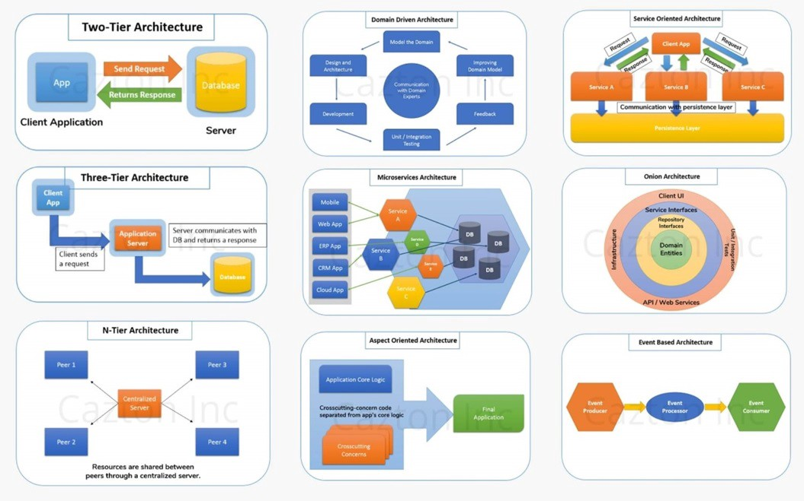

# Creating a gateway service with node js, typescript and fastify.

## What is a gateway?

An API gateway service is an infrastructure layer that sits at the front of all your back-end micro-services. Its specific purpose is to serve requests from the client by routing it to the correct back-end micro-service. In other words it is a node network, a key stopping point for data on its way to or from other networks. Thanks to gateways, we are able to communicate and send data back and forth without disclosing the location of other services.

## Why use gateway services?

- Prevents exposing internal concerns to external clients
- Adds an additional layer of security to your micro-services
- Enables support for mixing communication protocols
- Decreased micro-service complexity

## What architecture are we using when creating the gateway?

